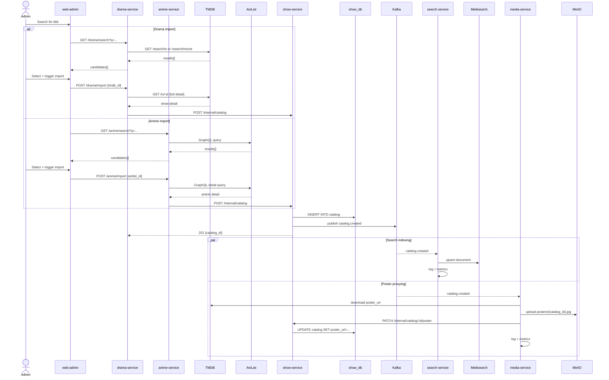

# 01 — Catalog Ingestion Flow

## Decisions

- `show-service` is the **sole writer** of `catalog` rows. No other service writes to `show_db.catalog` directly.
- `drama-service` and `anime-service` are **stateless import adapters** — they translate external API data into a catalog payload and delegate the write to `show-service` via an internal HTTP call.
- `drama-service` uses the **TMDB REST API** (replaces the MyDramaList HTML scraper).
- `anime-service` uses the **AniList GraphQL API** (unchanged).
- `search-service` indexes catalog entries in **Meilisearch** (replaces Elasticsearch).
- `media-service` **proxies poster images** to MinIO and writes the internal URL back via HTTP — `show-service` does not fire a Kafka event for poster-only patches.
- `catalog.deleted` triggers MinIO object cleanup in `media-service` and document removal in `search-service`.
- Observability: every service emits a structured log line and increments a Prometheus counter when it processes a `catalog.events` message.

---

## Event Orchestration

### Happy path — new catalog entry

- Admin searches via `drama-service` (`GET /drama/search?q=...`) or `anime-service` (`GET /anime/search?q=...`)
- Import adapter calls the appropriate external API (TMDB or AniList) and returns candidate results
- Admin selects a result and triggers import (`POST /drama/import` or `POST /anime/import`)
- Import adapter maps the external payload to the internal `CatalogCreateRequest` schema
- Import adapter calls `show-service` `POST /internal/catalog`
- `show-service` checks idempotency: rejects with `409 Conflict` if `tmdb_id` or `anilist_id` already exists
- `show-service` writes the row to `show_db.catalog`
- `show-service` publishes `catalog.created` to the `catalog.events` Kafka topic
- `show-service` returns `201 Created` with the new `catalog_id` to the import adapter
- Import adapter returns `201 Created` to the admin client

### Parallel downstream — search indexing

- `search-service` consumes `catalog.created` from `catalog.events`
- Upserts a document into the Meilisearch `catalog` index
- Emits structured log: `{"event":"catalog.indexed","catalog_id":"...","status":"ok"}`
- Increments Prometheus counter: `catalog_events_processed_total{service="search",event="catalog.created",status="ok"}`

### Parallel downstream — poster proxying

- `media-service` consumes `catalog.created` from `catalog.events`
- Downloads the raw `poster_url` (TMDB CDN or AniList CDN) to memory
- Uploads the image to MinIO under key `posters/{catalog_id}.{ext}`
- Calls `show-service` `PATCH /internal/catalog/:id/poster` with `{"poster_url": "http://minio/..."}` 
- `show-service` updates the column — **no Kafka event is fired** for this patch
- `media-service` emits structured log: `{"event":"poster.proxied","catalog_id":"...","status":"ok"}`
- Increments Prometheus counter: `catalog_events_processed_total{service="media",event="catalog.created",status="ok"}`

### catalog.updated

- Admin edits a catalog entry via `PATCH /catalog/:id` on `show-service`
- `show-service` fires `catalog.updated` to `catalog.events` only if a meaningful field changes (title, synopsis, genres, status, year, etc.) — **poster-only patches do not fire this event**
- `search-service` consumes `catalog.updated` and re-indexes the document in Meilisearch
- `media-service` consumes `catalog.updated`: if `poster_url` has changed to a new external URL, re-proxies and calls the poster patch endpoint

### catalog.deleted

- Admin deletes via `DELETE /catalog/:id` on `show-service`
- `show-service` fires `catalog.deleted` to `catalog.events`
- `search-service` removes the document from the Meilisearch index
- `media-service` deletes the MinIO object at `posters/{catalog_id}.*`
- Both services emit structured logs and increment their `catalog_events_processed_total` counter with `event="catalog.deleted"`

---

## Data Model Notes

- `catalog` table gains two new columns: `tmdb_id INT` and `anilist_id INT`, both with unique constraints
- Existing `mdl_id` column is removed (TMDB replaces MDL as the drama data source)
- Idempotency check in `show-service`: `SELECT 1 FROM catalog WHERE tmdb_id=$1 OR anilist_id=$1`

---

## Flow Diagram

