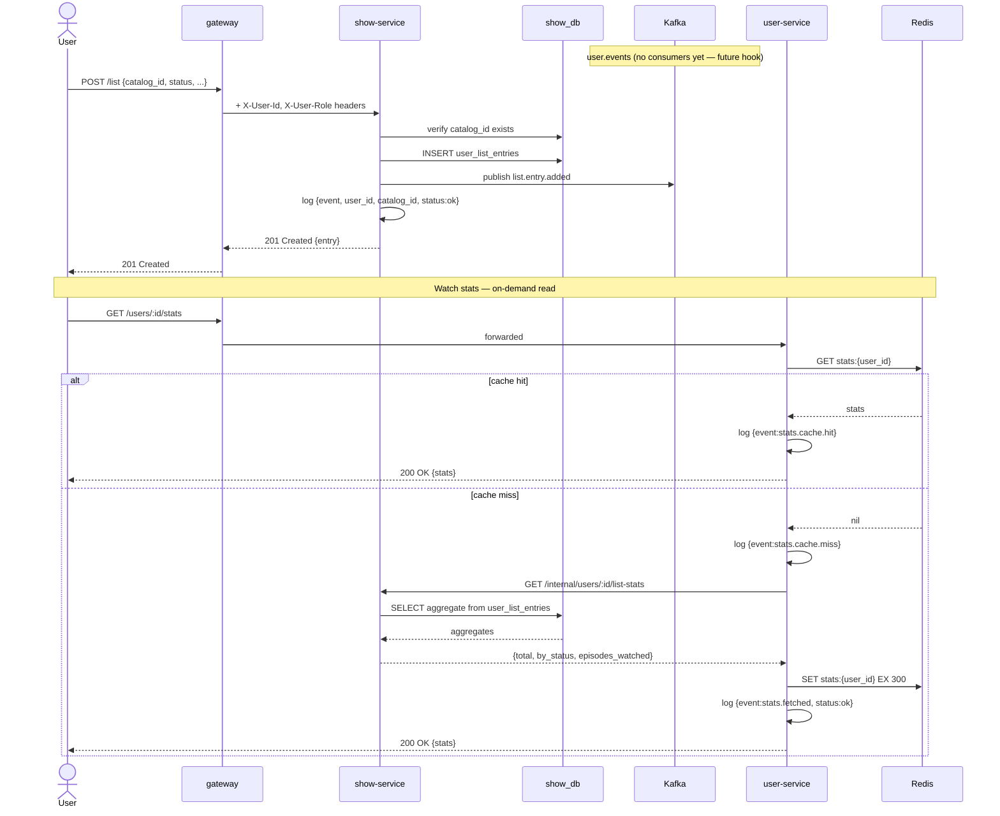

# 02 — User List Flow

## Decisions

- `show-service` owns all `user_list_entries` writes and publishes to the `user.events` Kafka topic on every mutation.
- `user.events` event types: `list.entry.added`, `list.entry.updated`, `list.entry.removed`.
- **No consumers for now** — topic is published eagerly as a future hook (ML pipeline, personalization, etc.).
- Watch stats are computed **on-demand**: client calls `user-service`, which calls `show-service`'s internal API. `show-service` owns the stats cache in its own Redis domain — cache hit returns immediately, cache miss aggregates from `user_list_entries` and populates the cache.
- **Caching strategy (global principle)**: long TTL (24 hours for stats) + proactive invalidation on write. `show-service` deletes `stats:{user_id}` from Redis immediately after any list mutation. The TTL is a safety net only — freshness is guaranteed by invalidation, not expiry.
- The existing `review.events → user-service (watch_stats)` consumer is **removed** — it was semantically incorrect. Review events and watch stats are separate concerns.
- Aggressive structured logging: every mutation and every Kafka publish emits a JSON log line. Stats cache hits and misses are also logged.

---

## Event Orchestration

### List entry added

- Authenticated user sends `POST /list` to `show-service` with `{catalog_id, status, episodes_watched, notes, tags, is_public}`
- Gateway injects `X-User-Id` and `X-User-Role` headers; `show-service` reads `X-User-Id` for ownership
- `show-service` verifies `catalog_id` exists in `catalog` table
- `show-service` inserts row into `user_list_entries`
- `show-service` publishes `list.entry.added` to `user.events`:
  ```json
  {"event":"list.entry.added","entry_id":"...","user_id":"...","catalog_id":"...","status":"watching"}
  ```
- `show-service` logs: `{"event":"list.entry.added","user_id":"...","catalog_id":"...","entry_id":"...","status":"ok"}`
- Returns `201 Created` with the new entry

### List entry updated

- User sends `PATCH /list/:id` to `show-service` with any subset of `{status, episodes_watched, notes, tags, is_public, started_at, completed_at}`
- `show-service` validates ownership (`entry.user_id == X-User-Id`)
- `show-service` updates the row
- `show-service` publishes `list.entry.updated` to `user.events`:
  ```json
  {"event":"list.entry.updated","entry_id":"...","user_id":"...","catalog_id":"...","changed_fields":["status","episodes_watched"]}
  ```
- `show-service` logs: `{"event":"list.entry.updated","entry_id":"...","user_id":"...","status":"ok"}`
- Returns `200 OK` with the updated entry

### List entry removed

- User sends `DELETE /list/:id` to `show-service`
- `show-service` validates ownership
- `show-service` deletes the row
- `show-service` publishes `list.entry.removed` to `user.events`:
  ```json
  {"event":"list.entry.removed","entry_id":"...","user_id":"...","catalog_id":"..."}
  ```
- `show-service` logs: `{"event":"list.entry.removed","entry_id":"...","user_id":"...","status":"ok"}`
- Returns `204 No Content`

### Watch stats — on-demand read

- Client sends `GET /users/:id/stats` to `user-service`
- `user-service` checks Redis for key `stats:{user_id}`
  - **Cache hit**: logs `{"event":"stats.cache.hit","user_id":"..."}`, returns immediately
  - **Cache miss**: logs `{"event":"stats.cache.miss","user_id":"..."}`
    - `user-service` calls `show-service` `GET /internal/users/:id/list-stats`
    - `show-service` aggregates from `user_list_entries`: `{total, by_status: {watching, completed, plan_to_watch, dropped}, total_episodes_watched}`
    - `user-service` writes result to Redis with 5-minute TTL
    - Logs: `{"event":"stats.fetched","user_id":"...","status":"ok"}`
- Returns stats to client

---

## Data Model Notes

- `user_list_entries` schema (unchanged): `user_id, catalog_id, status, episodes_watched, notes, tags[], is_public, started_at, completed_at`
- Status enum: `plan_to_watch | watching | completed | dropped | on_hold`
- Unique constraint: `(user_id, catalog_id)` — one entry per user per catalog item
- `review.events → user-service (watch_stats)` Kafka consumer is **removed from user-service**

---

## Flow Diagram

