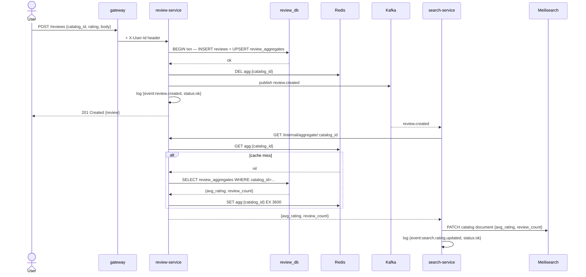

# 03 — Review Flow

## Decisions

- `review-service` owns all review writes and aggregate maintenance.
- Rating aggregates (`review_aggregates` table) are updated **in-process** within the same transaction as the review write — no self-consumer pattern, no async fan-out.
- `review-service` publishes to `review.events` on every mutation with types: `review.created`, `review.updated`, `review.deleted`.
- `search-service` consumes `review.events` to keep Meilisearch catalog documents fresh with up-to-date aggregate ratings — enables search results sorted/filtered by rating.
- Aggregate ratings are cached in `review-service`'s own Redis domain with a **1-hour TTL + proactive invalidation on write**.
- Aggressive structured logging: every review mutation, every Kafka publish, and every cache operation emits a JSON log line.

---

## Event Orchestration

### Review created

- Authenticated user sends `POST /reviews` to `review-service` with `{catalog_id, rating, body}`
- Gateway injects `X-User-Id`; `review-service` reads it for ownership
- `review-service` enforces uniqueness: one review per `(catalog_id, user_id)` — returns `409 Conflict` if duplicate
- In a single transaction:
  - Inserts row into `reviews`
  - Upserts `review_aggregates` for `catalog_id` (recalculates `avg_rating`, increments `review_count`)
- Invalidates Redis key `agg:{catalog_id}` immediately
- Publishes `review.created` to `review.events`:
  ```json
  {"event":"review.created","review_id":"...","user_id":"...","catalog_id":"...","rating":8}
  ```
- Logs: `{"event":"review.created","review_id":"...","user_id":"...","catalog_id":"...","status":"ok"}`
- Returns `201 Created` with the new review

### Review updated

- User sends `PATCH /reviews/:id` to `review-service` with `{rating?, body?}`
- `review-service` validates ownership (`review.user_id == X-User-Id`)
- In a single transaction:
  - Updates the `reviews` row
  - Recalculates and upserts `review_aggregates` for `catalog_id`
- Invalidates Redis key `agg:{catalog_id}`
- Publishes `review.updated` to `review.events`:
  ```json
  {"event":"review.updated","review_id":"...","user_id":"...","catalog_id":"...","rating":9}
  ```
- Logs: `{"event":"review.updated","review_id":"...","catalog_id":"...","status":"ok"}`
- Returns `200 OK` with updated review

### Review deleted

- User sends `DELETE /reviews/:id` to `review-service`
- `review-service` validates ownership
- In a single transaction:
  - Deletes the `reviews` row
  - Recalculates `review_aggregates` (decrements count, recalculates average; removes row if count reaches 0)
- Invalidates Redis key `agg:{catalog_id}`
- Publishes `review.deleted` to `review.events`:
  ```json
  {"event":"review.deleted","review_id":"...","user_id":"...","catalog_id":"..."}
  ```
- Logs: `{"event":"review.deleted","review_id":"...","catalog_id":"...","status":"ok"}`
- Returns `204 No Content`

### Aggregate rating read (cached)

- Client sends `GET /reviews/aggregate/:catalog_id` to `review-service`
- `review-service` checks Redis for key `agg:{catalog_id}`
  - **Cache hit**: logs `{"event":"agg.cache.hit","catalog_id":"..."}`, returns immediately
  - **Cache miss**: logs `{"event":"agg.cache.miss","catalog_id":"..."}`
    - Queries `review_aggregates` from DB
    - Writes to Redis with 1-hour TTL
    - Logs: `{"event":"agg.fetched","catalog_id":"...","status":"ok"}`
- Returns `{catalog_id, avg_rating, review_count}`

### Search enrichment (downstream)

- `search-service` consumes `review.created`, `review.updated`, `review.deleted` from `review.events`
- Calls `review-service` `GET /internal/aggregate/:catalog_id` to fetch the latest aggregate
- Patches the Meilisearch catalog document with `{avg_rating, review_count}`
- Logs: `{"event":"search.rating.updated","catalog_id":"...","avg_rating":8.4,"status":"ok"}`
- Increments Prometheus counter: `review_events_processed_total{service="search",event="review.created",status="ok"}`

---

## Data Model Notes

- `reviews`: `id, catalog_id, user_id, rating (1–10), body (rich text), created_at, updated_at`
- `review_aggregates`: `catalog_id (PK), avg_rating NUMERIC(4,2), review_count INT, updated_at`
- Unique constraint on `reviews`: `(catalog_id, user_id)`
- Meilisearch catalog document gains `avg_rating` and `review_count` fields (patchable without full re-index)

---

## Flow Diagram

