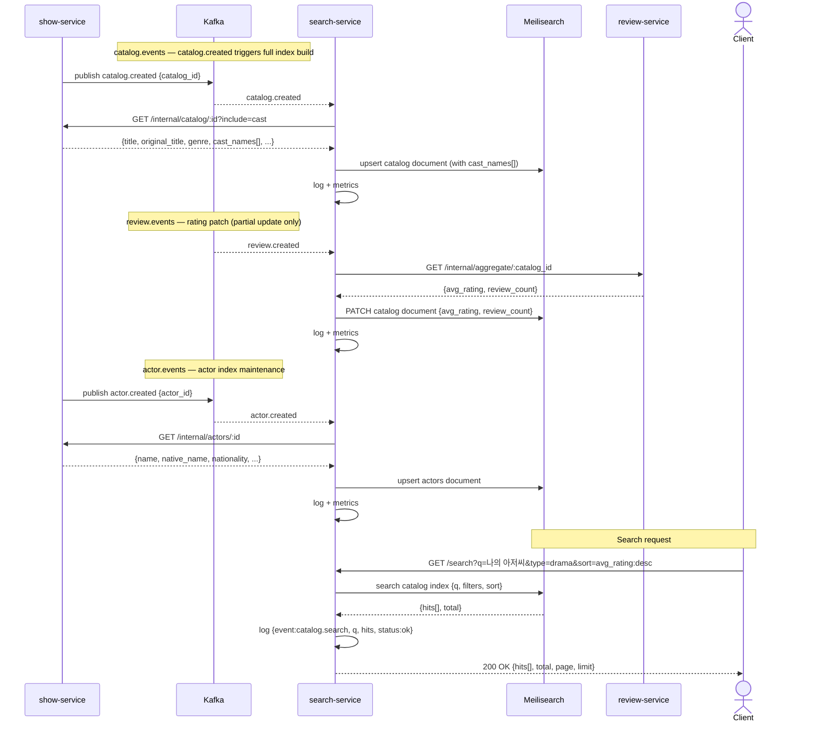

# 04 — Search Flow

## Decisions

- `search-service` maintains two Meilisearch indexes: `catalog` and `actors`.
- Catalog documents are **denormalized** — they include `cast_names[]` so actor-name searches hit a single index with no join.
- Kafka messages are **thin** (`catalog_id` + `event_type` only). `search-service` pulls the full document from `show-service`'s internal API before indexing — keeps Kafka payloads lean and decouples the message schema from the search document schema.
- Meilisearch is configured with `nonSeparatorTokens` for CJK scripts (Korean Hangul, Japanese Hiragana/Katakana/Kanji, Chinese Han) — native-language title and name search is a first-class requirement.
- `show-service` fires `catalog.updated` on **cast changes** in addition to content field changes — cast modification is a meaningful update that requires re-indexing `cast_names[]`.
- `show-service` publishes `actor.events` with types `actor.created`, `actor.updated`, `actor.deleted` on all actor CRUD operations.
- On `actor.updated` where name/native_name changes: `cast_names[]` in catalog documents referencing that actor are **not eagerly re-indexed** — names are refreshed on the next `catalog.updated` event for that entry. Accepted tradeoff given the extreme rarity of actor name corrections.
- Aggressive structured logging on all index operations and search queries.

---

## Meilisearch Index Configuration

### `catalog` index

| Setting | Value |
|---|---|
| Primary key | `id` |
| Searchable attributes | `title`, `original_title`, `synopsis`, `genre`, `country`, `cast_names` |
| Filterable attributes | `media_type`, `genre`, `country`, `language`, `year`, `airing_status` |
| Sortable attributes | `avg_rating`, `review_count`, `year` |
| Typo tolerance | enabled (default) |
| CJK tokens | `nonSeparatorTokens` set to include Hangul, CJK Unified Ideographs, Hiragana, Katakana ranges |

**Document shape:**
```json
{
  "id": "uuid",
  "title": "My Mister",
  "original_title": "나의 아저씨",
  "synopsis": "...",
  "media_type": "drama",
  "genre": ["melodrama", "slice of life"],
  "country": "South Korea",
  "language": "ko",
  "year": 2018,
  "airing_status": "completed",
  "episode_count": 16,
  "duration_minutes": 70,
  "poster_url": "http://minio/.../poster.jpg",
  "avg_rating": 9.2,
  "review_count": 1240,
  "cast_names": ["이선균", "IU", "Lee Sun-kyun", "아이유"],
  "tmdb_id": 12345,
  "anilist_id": null
}
```

### `actors` index

| Setting | Value |
|---|---|
| Primary key | `id` |
| Searchable attributes | `name`, `native_name`, `biography` |
| Filterable attributes | `nationality` |
| Sortable attributes | `name` |
| CJK tokens | same `nonSeparatorTokens` config as `catalog` index |

**Document shape:**
```json
{
  "id": "uuid",
  "name": "IU",
  "native_name": "아이유",
  "nationality": "South Korea",
  "birthdate": "1993-05-16",
  "biography": "...",
  "profile_image_url": "http://minio/.../profile.jpg"
}
```

---

## Event Orchestration

### Catalog index — document created

- `search-service` consumes `catalog.created` from `catalog.events`
- Calls `show-service` `GET /internal/catalog/:id?include=cast` to fetch full document + cast list
- Builds catalog document with `cast_names[]` (include both romanized and native-script names for each cast member)
- Upserts document into Meilisearch `catalog` index
- Logs: `{"event":"catalog.indexed","catalog_id":"...","op":"create","status":"ok"}`
- Increments: `search_index_operations_total{index="catalog",op="create",status="ok"}`

### Catalog index — document updated

- `search-service` consumes `catalog.updated` from `catalog.events` (fires on content changes OR cast changes)
- Calls `show-service` `GET /internal/catalog/:id?include=cast` for fresh full document
- Upserts into Meilisearch `catalog` index
- Logs: `{"event":"catalog.indexed","catalog_id":"...","op":"update","status":"ok"}`

### Catalog index — rating patch (from review flow)

- `search-service` consumes `review.created/updated/deleted` from `review.events`
- Calls `review-service` `GET /internal/aggregate/:catalog_id`
- Patches Meilisearch catalog document fields: `avg_rating`, `review_count` only (partial update)
- Logs: `{"event":"catalog.rating.patched","catalog_id":"...","avg_rating":9.2,"status":"ok"}`

### Catalog index — document deleted

- `search-service` consumes `catalog.deleted` from `catalog.events`
- Deletes document from Meilisearch `catalog` index
- Logs: `{"event":"catalog.deleted","catalog_id":"...","status":"ok"}`

### Actor index — document created/updated/deleted

- `search-service` consumes from `actor.events`
- On `actor.created` / `actor.updated`: calls `show-service` `GET /internal/actors/:id` for full actor data, upserts into `actors` index
- On `actor.deleted`: deletes document from `actors` index
- Logs: `{"event":"actor.indexed","actor_id":"...","op":"create|update|delete","status":"ok"}`
- Increments: `search_index_operations_total{index="actors",op="...",status="ok"}`

### Catalog search request

- Client sends `GET /search?q=...&type=drama&genre=romance&country=south+korea&year=2024&status=completed&sort=avg_rating:desc&page=1&limit=20`
- `search-service` translates query params to Meilisearch search call:
  - `q` → full-text search across searchable attributes
  - `type`, `genre`, `country`, `status`, `year` → Meilisearch filter expression
  - `sort` → Meilisearch sort parameter
  - `page` + `limit` → `offset` + `limit`
- Returns: `{hits[], total, page, limit}`
- Logs: `{"event":"catalog.search","q":"...","filters":"...","hits":12,"status":"ok"}`

### Actor search request

- Client sends `GET /search/actors?q=...&nationality=South+Korea&page=1&limit=20`
- `search-service` queries `actors` index with filter on `nationality` if provided
- Returns: `{hits[], total, page, limit}`
- Logs: `{"event":"actor.search","q":"...","hits":5,"status":"ok"}`

---

## Flow Diagram

