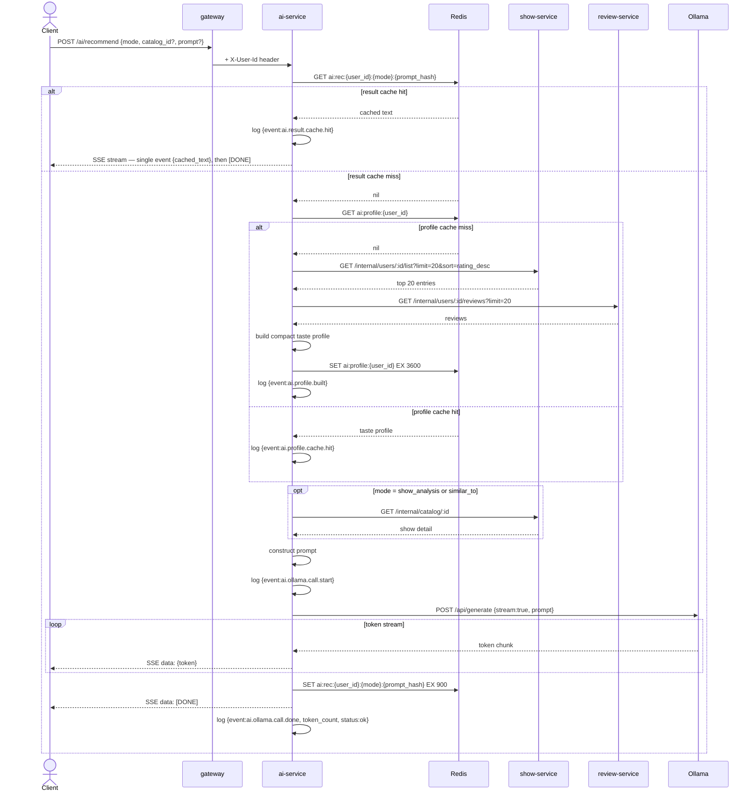

# 05 — AI Recommendations Flow

## Decisions

- All AI recommendations are **on-demand** — no background pre-processing.
- `ai-service` assembles its own context via internal HTTP calls to `show-service` and `review-service`. The client sends only `{mode, catalog_id?, prompt?}`.
- Single endpoint: `POST /ai/recommend` with a `mode` field: `list_based | show_analysis | similar_to`.
- Responses are streamed via **Server-Sent Events (SSE)** using Ollama's `stream: true`. Cache hits emit the full cached text as a single SSE event — client behaviour is uniform regardless of cache state.
- **Two-layer Redis caching** (shared single Redis instance — all keys namespaced):
  - **Taste profile** — `ai:profile:{user_id}` — 1-hour TTL. Built from top 20 completed/watching entries sorted by user rating descending, summarized as genre distribution, country preferences, and standout titles. Shared across all modes for the same user.
  - **Full result** — `ai:rec:{user_id}:{mode}:{prompt_hash}` — 15-minute TTL. Cached after stream completes. Returned immediately on repeat requests.
- Aggressive structured logging: context assembly, cache hits/misses, Ollama call start/end, and stream completion all emit JSON log lines.

---

## Redis Key Namespace Reference (all services, shared instance)

| Key pattern | Owner | TTL |
|---|---|---|
| `show:stats:{user_id}` | show-service | 24h, invalidated on list write |
| `review:agg:{catalog_id}` | review-service | 1h, invalidated on review write |
| `ai:profile:{user_id}` | ai-service | 1h |
| `ai:rec:{user_id}:{mode}:{prompt_hash}` | ai-service | 15m |

---

## Request Schema

```json
POST /ai/recommend
{
  "mode": "list_based",          // required: list_based | show_analysis | similar_to
  "catalog_id": "uuid",          // required for show_analysis and similar_to
  "prompt": "strong female leads" // optional free-text hint, any mode
}
```

---

## Mode Context Requirements

| Mode | Context needed |
|---|---|
| `list_based` | Taste profile only |
| `show_analysis` | Taste profile + target show detail |
| `similar_to` | Taste profile + target show detail |

---

## Event Orchestration

### On-demand recommendation — cache miss (full path)

- Client sends `POST /ai/recommend` with `{mode, catalog_id?, prompt?}`; gateway injects `X-User-Id`
- `ai-service` checks Redis `ai:rec:{user_id}:{mode}:{prompt_hash}`
  - **Cache miss** — proceeds to generate
- `ai-service` checks Redis `ai:profile:{user_id}`
  - **Profile cache miss**:
    - Calls `show-service` `GET /internal/users/:id/list?limit=20&sort=rating_desc&status=completed,watching`
    - Calls `review-service` `GET /internal/users/:id/reviews?limit=20`
    - Builds compact taste profile: genre counts, top countries, avg rating given, standout titles (rated ≥ 8)
    - Writes `ai:profile:{user_id}` to Redis with 1-hour TTL
    - Logs: `{"event":"ai.profile.built","user_id":"...","entry_count":20,"status":"ok"}`
  - **Profile cache hit**:
    - Logs: `{"event":"ai.profile.cache.hit","user_id":"..."}`
- If `mode` is `show_analysis` or `similar_to`:
  - Calls `show-service` `GET /internal/catalog/:id` to fetch target show detail
- Constructs Ollama prompt from taste profile + mode + optional target show + optional free-text prompt
- Logs: `{"event":"ai.ollama.call.start","user_id":"...","mode":"...","model":"llama3"}`
- Opens SSE response stream (`Content-Type: text/event-stream`)
- Calls Ollama `POST /api/generate` with `stream: true`
- Pipes each token chunk to client as `data: {token}\n\n`
- On stream completion:
  - Caches full assembled text to Redis `ai:rec:{user_id}:{mode}:{prompt_hash}` with 15-minute TTL
  - Sends `data: [DONE]\n\n` to client
  - Logs: `{"event":"ai.ollama.call.done","user_id":"...","mode":"...","token_count":320,"status":"ok"}`

### On-demand recommendation — cache hit (fast path)

- `ai-service` checks Redis `ai:rec:{user_id}:{mode}:{prompt_hash}`
  - **Cache hit**:
    - Logs: `{"event":"ai.result.cache.hit","user_id":"...","mode":"..."}`
    - Opens SSE response stream
    - Emits full cached text as single `data: {full_text}\n\n` event
    - Sends `data: [DONE]\n\n`
    - Returns immediately

---

## Prompt Construction (per mode)

### `list_based`
```
You are a drama and anime recommendation engine.

User taste profile:
- Top genres: melodrama (8), romance (6), thriller (3)
- Preferred countries: South Korea, Japan
- Average rating given: 8.4/10
- Standout titles: My Mister, Signal, Crash Landing on You

Recommend 5 shows this user has not watched. For each, give the title, a one-sentence reason it matches their taste, and a confidence score (1-10).
{{optional free-text prompt appended here}}
```

### `show_analysis`
```
You are a drama recommendation advisor.

User taste profile: [same as above]

Target show: "Vincenzo" (2021, Korean crime/comedy, 20 episodes)
Synopsis: [synopsis from catalog]

Explain in 3 sentences why this user specifically would or would not enjoy this show based on their taste profile.
{{optional free-text prompt appended here}}
```

### `similar_to`
```
You are a drama recommendation engine.

User taste profile: [same as above]

Reference show: "Signal" (2016, Korean thriller, 16 episodes)
Genres: thriller, crime, mystery

Recommend 5 shows similar to Signal that also match this user's taste. Give title, similarity reason, and confidence score (1-10).
{{optional free-text prompt appended here}}
```

---

## Flow Diagram

