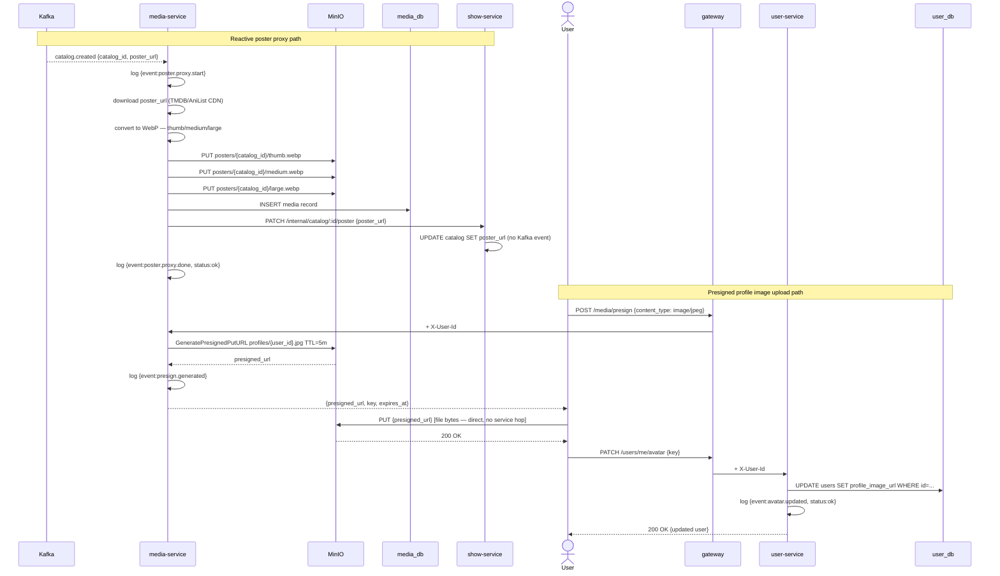

# 06 — Media Flow

## Decisions

- `media-service` has two distinct upload paths that coexist:
  - **Reactive poster path** — triggered by Kafka `catalog.created`; media-service downloads the external poster URL, converts to WebP with three size variants (thumb/medium/large), uploads to MinIO, calls `show-service` to patch `poster_url`. Records tracked in `media_db`.
  - **Presigned URL path** — for user profile image uploads. Client requests a presigned PUT URL from `media-service`, uploads the file directly to MinIO (never touches the service), then confirms completion to `user-service`. No server-side image processing for this path — client is responsible for crop/resize before upload (standard pattern for profile pictures). No `media_db` record — URL stored directly in `user_db`.
- The existing `POST /media/upload` multipart endpoint is **preserved** for admin use cases where server-side WebP processing is needed (e.g., actor profile photos uploaded from web-admin).
- New endpoint added: `POST /media/presign` — generates a MinIO presigned PUT URL for a user's profile image.
- Profile image MinIO key pattern: `profiles/{user_id}.{ext}` — predictable, fixed key means new uploads overwrite old ones automatically. No orphan cleanup required.
- Catalog poster MinIO key pattern: `posters/{catalog_id}/thumb.webp`, `posters/{catalog_id}/medium.webp`, `posters/{catalog_id}/large.webp`
- On `catalog.deleted`: media-service deletes all three poster variant objects from MinIO.
- Aggressive structured logging on all MinIO operations, Kafka consumption, and presign generations.

---

## Event Orchestration

### Reactive poster proxy (catalog.created)

- `media-service` consumes `catalog.created` from `catalog.events`
- Logs: `{"event":"poster.proxy.start","catalog_id":"...","source_url":"..."}`
- Downloads raw image from `poster_url` (TMDB CDN or AniList CDN)
- Converts to WebP; generates three variants:
  - `thumb` — 120×180px
  - `medium` — 300×450px
  - `large` — 600×900px
- Uploads all three to MinIO under `posters/{catalog_id}/`
- Inserts record into `media_db`
- Calls `show-service` `PATCH /internal/catalog/:id/poster` with `{poster_url: "/media/file/{catalog_id}?size=medium"}`
- Logs: `{"event":"poster.proxy.done","catalog_id":"...","status":"ok"}`
- Increments: `catalog_events_processed_total{service="media",event="catalog.created",status="ok"}`
- On any failure: logs `{"event":"poster.proxy.failed","catalog_id":"...","error":"...","status":"error"}` — does not retry automatically (admin can re-trigger via internal endpoint if needed)

### Reactive poster cleanup (catalog.deleted)

- `media-service` consumes `catalog.deleted` from `catalog.events`
- Deletes MinIO objects: `posters/{catalog_id}/thumb.webp`, `medium.webp`, `large.webp`
- Soft-deletes `media_db` record for the catalog entry
- Logs: `{"event":"poster.cleanup.done","catalog_id":"...","status":"ok"}`
- Increments: `catalog_events_processed_total{service="media",event="catalog.deleted",status="ok"}`

### Profile image upload — presigned URL path

- Authenticated user calls `POST /media/presign` with `{content_type: "image/jpeg|image/png|image/webp"}`
- Gateway injects `X-User-Id`
- `media-service` validates `content_type`; derives extension
- Generates MinIO presigned PUT URL for key `profiles/{user_id}.{ext}` with **5-minute expiry**
- Returns: `{presigned_url, key, expires_at}`
- Logs: `{"event":"presign.generated","user_id":"...","key":"profiles/...","status":"ok"}`
- Client PUTs file directly to `presigned_url` — bypasses all services
- Client calls `PATCH /users/me/avatar` on `user-service` with `{key: "profiles/{user_id}.jpg"}`
- `user-service` constructs internal URL: `http://media-service/media/file/profile/{user_id}`
- `user-service` updates `profile_image_url` in `user_db`
- Logs: `{"event":"avatar.updated","user_id":"...","status":"ok"}`
- Returns updated user profile

### Admin media upload — multipart path (existing, preserved)

- Admin calls `POST /media/upload` with multipart form: `{entity_type, entity_id, media_type, file}`
- `media-service` validates MIME type, processes to WebP variants (thumb/medium/large)
- Uploads all three variants to MinIO
- Inserts record into `media_db`
- Returns `{id, thumb_url, medium_url, large_url}`

---

## Data Model Notes

- `media_db.media` table (unchanged): `id, entity_type, entity_id, media_type, thumb_url, medium_url, large_url, s3_key_prefix, size_bytes, is_active, created_at`
- Profile images are **not** recorded in `media_db` — URL stored directly in `user_db.users.profile_image_url`
- New endpoint: `POST /media/presign {content_type}` → `{presigned_url, key, expires_at}`

---

## Flow Diagram

