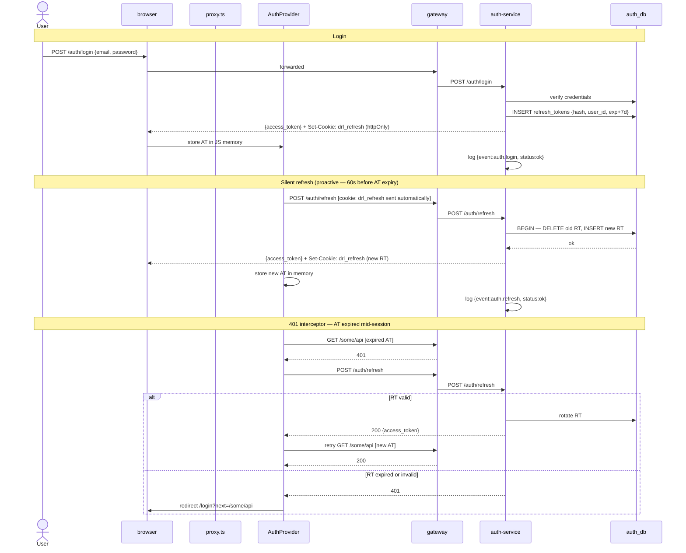

# 07 — Auth Flow

## Decisions

- Access tokens (AT): RS256 JWT, **15-minute TTL**, contains `{user_id, role}`, returned in response body, stored in **JavaScript memory only** (never localStorage, never a readable cookie — prevents XSS exfiltration).
- Refresh tokens (RT): opaque 64-byte random token, **7-day TTL**, stored as `hash(token)` in `auth_db.refresh_tokens`, delivered as `httpOnly + Secure + SameSite=Strict` cookie `drl_refresh`.
- **RT rotation on every refresh**: old RT row is deleted and a new RT is issued in the same transaction. A stolen RT can only be used once before the legitimate client rotates it away.
- **Silent refresh rule**: `AuthProvider` only redirects to `/login` when `POST /auth/refresh` returns `401`. Network errors and `5xx` responses trigger a retry (up to 3 times, exponential backoff) before redirecting. This is the gap in the current implementation.
- **Gateway 401 interceptor**: when the API client receives a `401` on any request (AT expired mid-session), it pauses the request, triggers a silent refresh, and retries the original request with the new AT. Redirect to login only if the refresh itself returns `401`.
- `proxy.ts` middleware check (`request.cookies.has("drl_refresh")`) remains valid as a **routing gate only** — it prevents unauthenticated page renders. It is not a substitute for AT validation.
- Aggressive structured logging on all auth events: login, refresh, logout, rotation, and validation failures.

---

## Token Lifecycle

| Token | TTL | Storage | Transport |
|---|---|---|---|
| Access Token (AT) | 15 min | JS memory | `Authorization: Bearer` header |
| Refresh Token (RT) | 7 days | httpOnly cookie `drl_refresh` | Sent automatically by browser |

---

## Event Orchestration

### Email/password login

- Client sends `POST /auth/login {email, password}`
- `auth-service` validates credentials against `auth_db.users` (bcrypt)
- On success:
  - Signs AT: `{user_id, role, exp: now+15m}` with RS256 private key
  - Generates RT: 64-byte CSPRNG token; stores `{hash, user_id, expires_at: now+7d}` in `auth_db.refresh_tokens`
  - Sets `drl_refresh` cookie: `httpOnly; Secure; SameSite=Strict; Path=/auth/refresh; MaxAge=604800`
  - Returns AT in response body: `{access_token, expires_in: 900}`
- Logs: `{"event":"auth.login","user_id":"...","method":"password","status":"ok"}`
- On failure: returns `401`; logs `{"event":"auth.login.failed","email":"...","reason":"invalid_credentials"}`

### Google OAuth login

- Client redirects to `GET /auth/google` → `auth-service` redirects to Google consent screen
- Google redirects to `GET /auth/google/callback?code=...`
- `auth-service` exchanges code for Google profile; upserts user in `auth_db.users`
- Same AT + RT issuance as email/password login
- Logs: `{"event":"auth.login","user_id":"...","method":"google","status":"ok"}`

### Silent AT refresh (fixed flow)

- `AuthProvider` proactively checks AT expiry on a timer (fires 60 seconds before AT expires)
- OR: API client 401 interceptor triggers refresh when a request returns `401`
- Client calls `POST /auth/refresh` — browser sends `drl_refresh` cookie automatically
- `auth-service`:
  - Hashes the RT from cookie; looks up row in `auth_db.refresh_tokens`
  - Validates: row exists, `expires_at > now`, `user_id` matches
  - **In a single transaction**: deletes old RT row; inserts new RT row (rotation)
  - Issues new AT
  - Sets new `drl_refresh` cookie (new RT value, reset MaxAge)
  - Returns `{access_token, expires_in: 900}`
- `AuthProvider` stores new AT in memory; resumes any pending requests
- Logs: `{"event":"auth.refresh","user_id":"...","status":"ok"}`

**Error handling (the fix):**

| Refresh response | Client action |
|---|---|
| `200 OK` | Store new AT, retry original request |
| `401 Unauthorized` | RT expired or invalid → redirect to `/login?next=<path>` |
| `5xx` / network error | Retry up to 3× with exponential backoff (1s, 2s, 4s); after 3 failures → redirect to `/login` |

### Logout

- Client calls `POST /auth/logout` (AT in `Authorization` header)
- `auth-service` reads `drl_refresh` cookie; deletes RT row from `auth_db`
- Clears `drl_refresh` cookie (`MaxAge=0`)
- Returns `204 No Content`
- Client clears in-memory AT
- Logs: `{"event":"auth.logout","user_id":"...","status":"ok"}`

### Gateway AT validation (every request)

- OpenResty Lua validates AT signature (RS256 public key) and `exp` claim
- Valid AT: injects `X-User-Id` and `X-User-Role` headers; passes request upstream
- Expired or invalid AT: returns `401` to client → triggers 401 interceptor (see silent refresh)
- Logs validation failures: `{"event":"auth.token.invalid","reason":"expired|bad_signature","path":"..."}`

---

## Data Model Notes

- `auth_db.refresh_tokens`: `{id, user_id FK, token_hash CHAR(64), expires_at TIMESTAMPTZ, created_at}`
- `token_hash` is `SHA-256(raw_token)` — raw token never stored
- Unique index on `token_hash`
- `auth_db.users` unchanged: `{id, email, password_hash, is_admin, google_id, created_at}`

---

## Flow Diagram

